<!--
_footer: ""
_paginate: skip
-->

<div class="topbottom-align">
<div class="slide-title">
    <h1>Rust勉強会2</h1>
</div>

<div class="slide-info">
    <div>〜【第1回】Rustlings の環境構築と Rust の概要 〜</div>
</div>
</div>

---

# 勉強会について (1/2)

- [Rustlings](https://github.com/rust-lang/rustlings) を題材に進めます
  - [exercises](https://github.com/rust-lang/rustlings/tree/main/exercises) から2~3問取り組みます
    - 予告で予習範囲を提示します
  - Rustlings自体が [The Rust Programming Language](https://doc.rust-jp.rs/book-ja/) (通称 TRPL) に基づくので、こちらも適宜参照

---

# 勉強会について (2/2)

- 毎週金曜日 18:00 ~ 19:00 開催

- (TBD: Meetで、イベント作成)
  - 録画
  - 要約AI

- 以下を共有
  - 本スライド (開始前)
  - 勉強会の動画 (終了後)

---

# 主催自己紹介

## namnium ( @r_okuyama )

Rust好きの24卒。Rustの記事をQiitaに投稿するのが趣味で、記事投稿マラソンを2回走破。最近は手続きマクロを書いています！

## kii ( @ki_sato )

---

# 【第1回】目次

1. Rustとは？なぜRust？
2. Rustのインストール
3. Rustlingsのインストール
4. 00_intro実行確認

---
<!--
footer: "Rust勉強会2【第1回】(1. Rustとは？なぜRust？)"
-->

<div class="group-title">
    <h1>1. Rustとは？なぜRust？</h1>
</div>

---

# The Book (TRPL) の[まえがき](https://doc.rust-jp.rs/book-ja/foreword.html) (1/2)

すぐにはわかりにくいかもしれませんが、
Rustは、 **エンパワーメント** を根本原理としています:

どんな種類のコードを現在書いているにせよ、
Rustは幅広い領域で以前よりも遠くへ到達し、
**自信を持って** プログラムを組む力を与え(empower)ます。

---

# The Book (TRPL) の[まえがき](https://doc.rust-jp.rs/book-ja/foreword.html) (2/2)

* Rustは、**古い落とし穴を排除** し、その過程で使いやすく
  役に立つ洗練された一連のツールを提供する
  - 落とし穴の例:
    セグフォ、シャローコピー、レースコンディション...etcetc

* Rustは低レベルなシステムプログラミングに限定されない
  - **十分に表現力豊かでエルゴノミック** なので、
  コマンドラインアプリやWebサーバ、
  その他様々な楽しいコードを書ける

---

# Wikipedia曰く (1/2)

- 性能、メモリ安全性、安全な並行性を目指して設計された
  **マルチパラダイム** のプログラミング言語
  - 関数型パラダイム
  - ポストOOPパラダイム
    - (OOPの反省を踏まえたパラダイム)
- **C/C++に代わる** システムプログラミング言語を目指しており、
  構文的にはC++に似ている
  - 余談: (C)rustacean 🦀

---

# Wikipedia曰く (2/2)

- 「ボローチェッカー」(borrow checker) で参照の有効性を
  検証することによってメモリ安全性を保証できる
- Rustは **ガベージコレクションなしで** のメモリ安全性を達成
  - 必要な場面で参照カウントを使うこともできる

所有権やライフライム周りは確かに慣れが必要だが、
いつでも向き合わなければならないわけではない

---

# 結局Rustのメリットは...？

色々ありますがRustを一言で表すなら...

「**より多くの情報・挙動を型/トレイトで説明できる言語**」

- 表現力の高い列挙型
  - 余談: 直和型
- 可変性
- スレッド安全性

---

# 型/トレイトで説明できる言語

```rust
(TBD)
```

---

# 勉強会の目的・目標

* 自信を持ってRustを書けるようになる
* 自信を持って **他言語も** 書けるようになる

---
<!--
footer: "Rust勉強会2【第1回】(2. Rustのインストール)"
-->

<div class="group-title">
    <h1>2. Rustのインストール</h1>
</div>

---

# rustupのインストール 1/n

rustupは、Rustツールチェイン(rustcやcargo)の管理用ツール

- curl
- brew

どちらかで rustup を入れる。無難なのは `curl`

```bash
curl --proto '=https' --tlsv1.2 -sSf https://sh.rustup.rs | sh
```

---

# rustupのインストール 2/n

```bash
curl --proto '=https' --tlsv1.2 -sSf https://sh.rustup.rs | sh
```

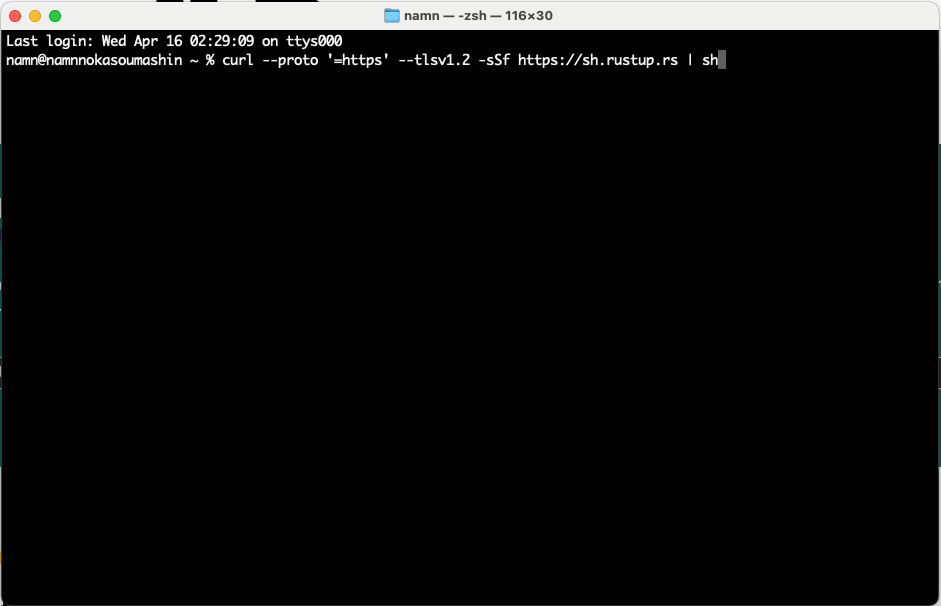

---

# rustupのインストール 3/n

しばらくするとインストールに関するセレクトが出てくる

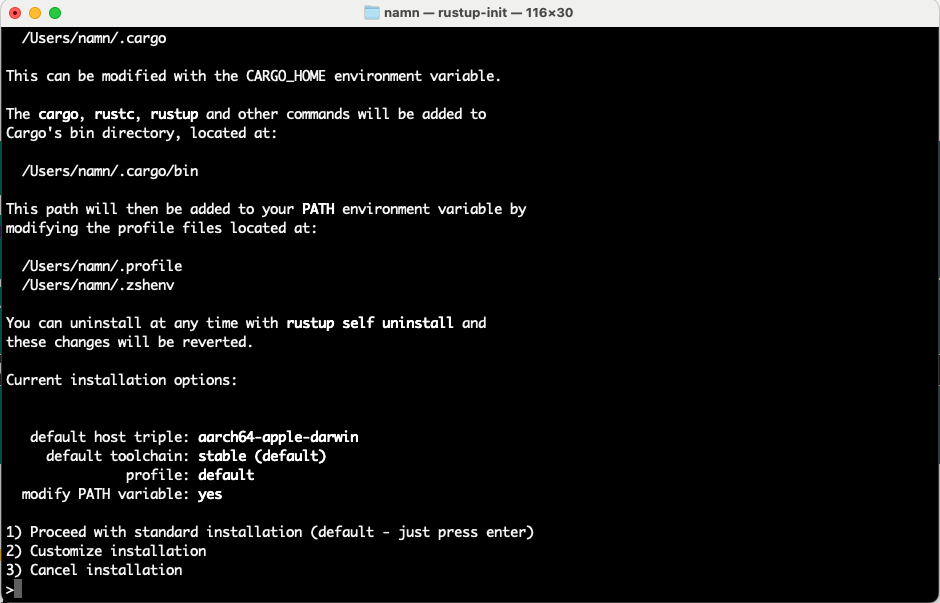

1 を選ぶ

---

# rustupのインストール 4/n

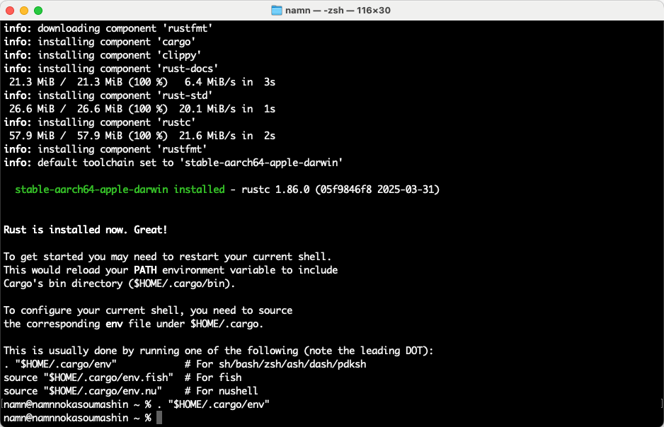

---

# rustupのインストール 5/n

ターミナルを再起動しない場合以下を打つ

```bash
. "$HOME/.cargo/env"
```

インストールされたツールのバージョンを確認する

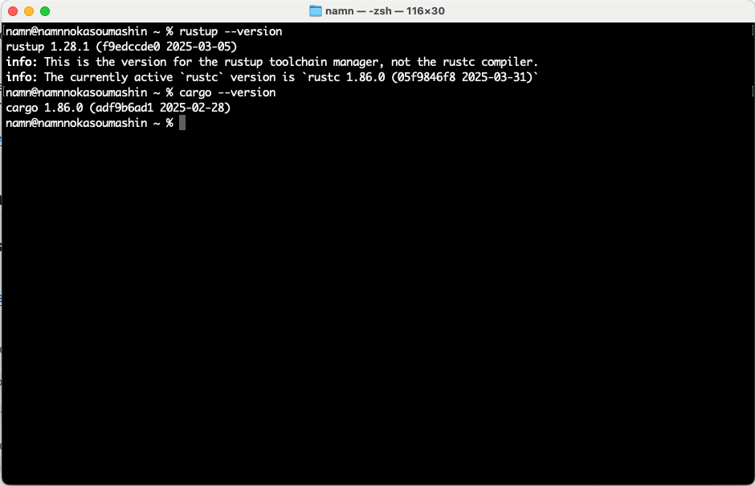

---

# rustupのインストール 6/n

Mac向けビルドのために、Xcodeコマンドラインツールをインストールする

```zsh
xcode-select --install
```

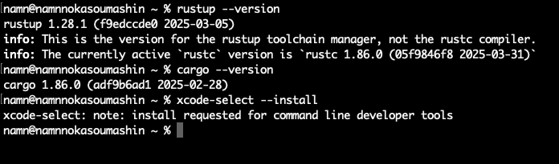

---

# rustupのインストール 7/n

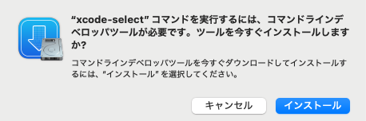

使用許諾に同意しインストール


---


```bash
cargo install rustlings
```

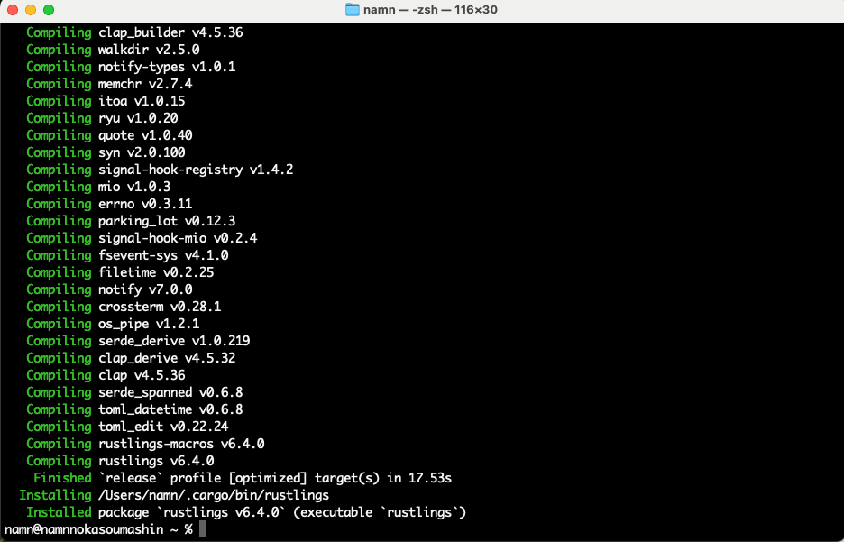

cd した上で

```bash
rustlings init
```

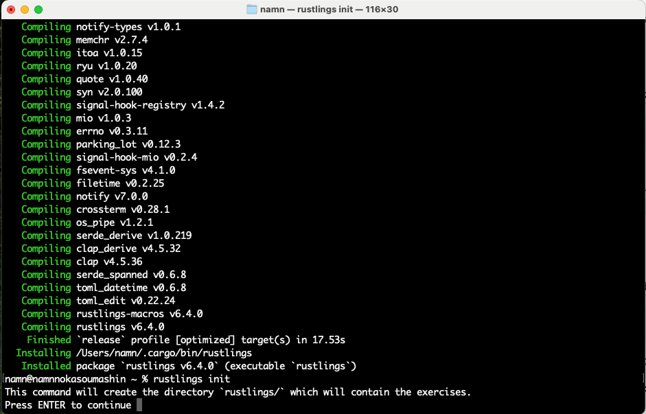

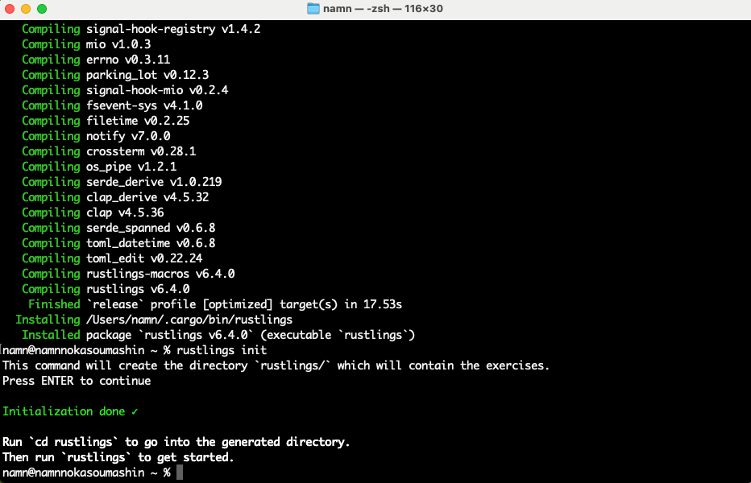

- VSCode のインストール
- rust-analyzer のインストール 

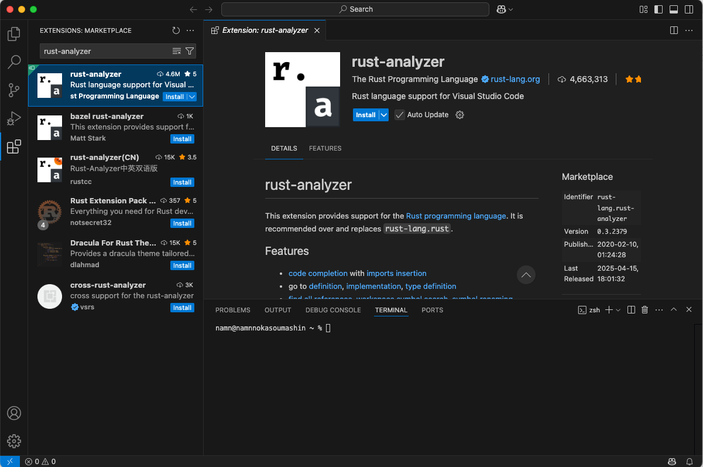

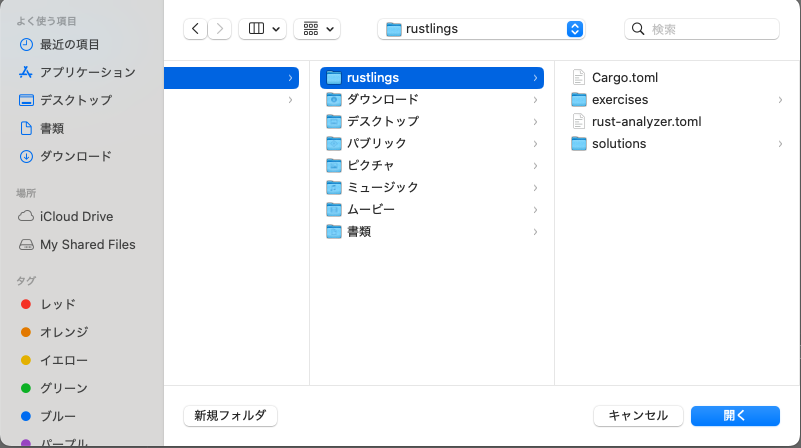

VSCode 上で rustlings フォルダを開き `rustlings` コマンドを実行する

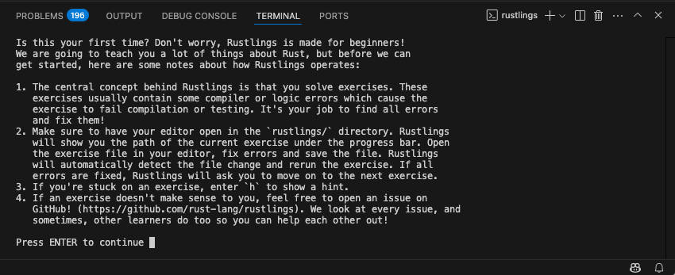

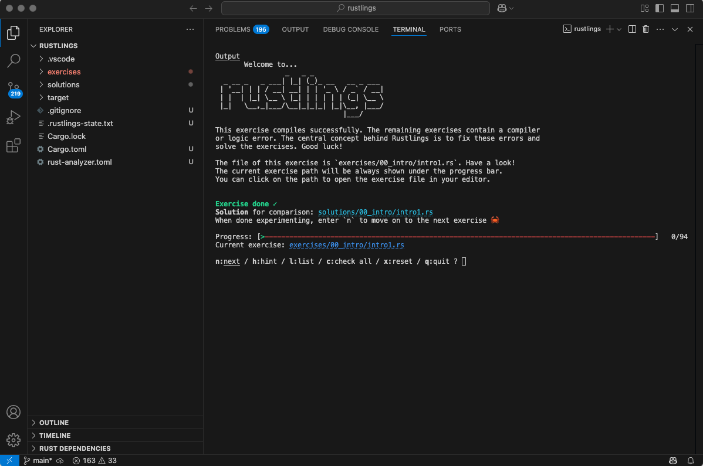

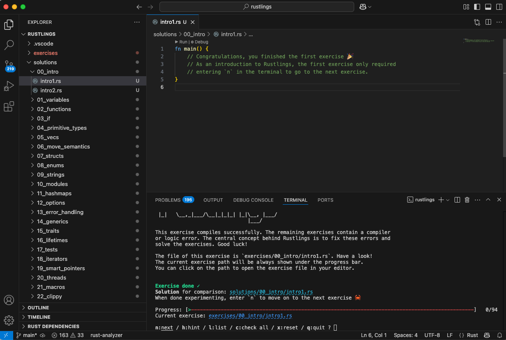

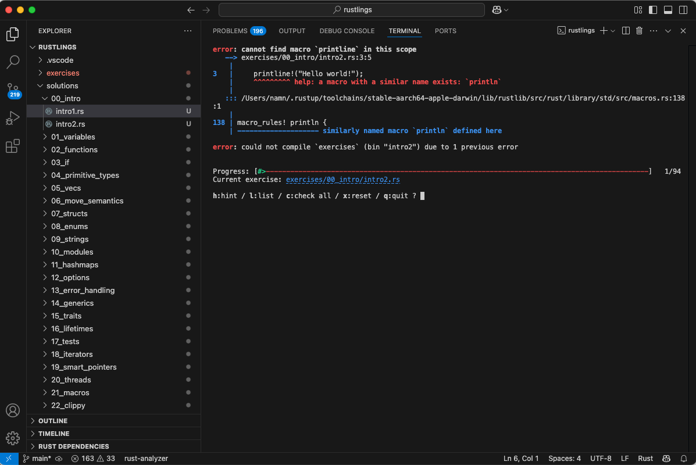

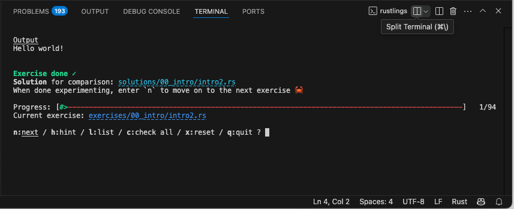

---
<!--
footer: "Rust勉強会2【第1回】(3. Rustlingsのインストール)"
-->

<div class="group-title">
    <h1>3. Rustlingsのインストール</h1>
</div>

---
<!--
footer: "Rust勉強会2【第1回】(4. 00_intro実行確認)"
-->

<div class="group-title">
    <h1>4. 00_intro実行確認</h1>
</div>