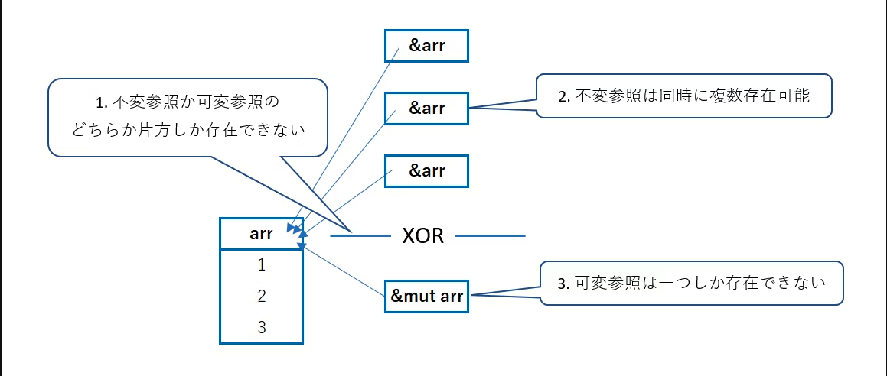

<!--
_footer: ""
_paginate: skip
-->

<div class="topbottom-align">
<div class="slide-title">
    <h1>Rust勉強会2nd</h1>
</div>

<div class="slide-info">
    <div>〜【第7回】所有権(2)・構造体 〜</div>
</div>
</div>

---

# 【第7回】目次

1. 所有権
   1. (前回スライド再掲)
   2. move_semantics(1|2|3).rs ← 本日ここから
   3. 不変参照・可変参照の説明
   4. move_semantics4.rs, move_semantics5.rs
2. 構造体
   1. 説明
   2. structs1.rs, structs2.rs, structs3.rs

---

# 本日のRustミニクイズ!

<div class="mini-font-marker-8"></div>

```rust
macro_rules! check_impl_copy {
    ($v:expr) => {
        let v1 = $v;
        let v2 = v1;
        println!("{v1:?}, {v2:?}");
    };
}

fn main() {
    /* 1. */ check_impl_copy!(10);
    /* 2. */ check_impl_copy!('\u{3042}');
    /* 3. */ check_impl_copy!(vec![1, 2, 3]);
    /* 4. */ check_impl_copy!([1, 2, 3]);
}
```

 1. ~ 4. のうちコンパイルエラーとなる行はどれでしょう？

---

# 本日のRustミニクイズ! 補足

<div class="mini-font-marker-8"></div>

```rust
macro_rules! check_impl_copy {
    ($v:expr) => {
        let v1 = $v;
        let v2 = v1;
        println!("{v1:?}, {v2:?}");
    };
}
```

補足: `check_impl_copy!(true)` は以下に展開されます

```rust
let v1 = true;
let v2 = v1;
println!("{v1:?}, {v2:?}");
```

---
<!--
footer: "Rust勉強会2nd【第6回】(1. 所有権)"
-->

<div class="group-title">
    <h1>1. 所有権</h1>
</div>

---

# (再掲) 最初の難関: 所有権

* 今回ばかりは [The Book](https://doc.rust-jp.rs/book-ja/ch04-01-what-is-ownership.html) を読んで...という感じですが、
コアイメージだけ頑張って言語化してみます

* 所有権は **ガベージコレクションを使わずに**
メモリ安全を実現するための **爆弾ゲーム** 💣

---

# (再掲) 所有権は爆弾ゲーム 💣 ？

ルール

1. 参加者は変数
2. `Vec<T>`など、ある値が**プリミティブ型ではない時**
(`Copy` を実装しない時)、"値"を爆弾とみなす
3. **値として評価されたら** 爆弾を手放せる
4. **爆弾を持っている時だけ** 爆弾にアクセス可能 (所有権)

---

```rust
fn main() {
    // vec![...]が爆弾
    let v = vec![1, 2, 3]; // v は爆弾を持つ
    println!("{:?}", v); // vを経由して爆弾にアクセス可能

    let v2 = v; // 右辺で評価されるので、爆弾を手放す

    println!("{:?}", v); // 爆弾はもう持ってないのでコンパイルエラー！

    println!("{:?}", v2); // v2 は爆弾にアクセスできる
}
```

---

ルール続き

* 1. 参加者は変数
2.ある値が**プリミティブ型ではない時** "値"を爆弾とみなす
3.**値として評価されたら**爆弾を手放せる
4.**爆弾を持っている時だけ** 爆弾にアクセス可能 (所有権)

* 5. 自分のスコープ終端まで来たら爆発💥
**メモリ上から片付ける義務**が生じ、爆弾は消滅 (所有権も消える)

誰かがメモリを片付けないと、メモリリークになってしまう

---

```rust
let v_res = {
    let v = vec![1, 2, 3]; // v は爆弾を持つ
    println!("{:?}", v); // vを経由して爆弾にアクセス可能

    let v2 = v.clone(); // 爆弾の複製！

    v2 // v2 は評価されるので、ギリギリ爆弾を外に捨てれた
}; // v は爆弾が爆発！メモリを片付ける

// 代わりに v_res が爆弾を片付ける
```

---

# (再掲) 背景: C言語の `free` 関数

GCがないC言語は、ヒープに確保した動的配列は
自分で `free` しないとメモリリークになります。

```c
#include <stdlib.h>

int main(void) {
    int* v = (int*)malloc(10); // ヒープにメモリ確保

    // ...

    free(v); // これがないとメモリリーク！
} 
```

---

常駐アプリケーションではメモリリークを許容したくありません

一方でプログラマが `free` 関数を自分で呼ぶことで、
「二重freeバグ」などの数々の凶悪なバグが生まれてきました...

基本的に **「スコープ終端で `free` する」**
とルールを決めたのがRust、というわけです！

---

# move_semantics(1|2|3).rs 問題 1/2

move_semantics1.rs ~ move_semantics3.rs
は簡単かつ類似した問題のためまとめて行います

```rust
// TODO: 新しい行を加えることなくコンパイルエラーを修正してください
fn fill_vec(vec: Vec<i32>) -> Vec<i32> {
    // let mut vec = vec; // <- これの使用禁止！

    vec.push(88);

    vec
}
```

---

# move_semantics(1|2|3).rs 問題 2/2

こちらが本命の問題です。

```rust
// TODO: コンパイルエラーを直すため、vec0とvec1に**同時に**アクセスできるようにしてください
#[test]
fn move_semantics2() {
    let vec0 = vec![22, 44, 66];

    let vec1 = fill_vec(vec0);

    assert_eq!(vec0, [22, 44, 66]);
    assert_eq!(vec1, [22, 44, 66, 88]);
}
```

---

# 困ったら `clone` で解決！

`#[derive(Clone)]` として `Clone` トレイトが実装されている型ならば、
`.clone()` で複製が可能

```rust
#[derive(Clone)]
// ↑ プリミティブ型しか含まない時は #[derive(Clone, Copy)] なんかにも
struct Human(String);

fn main() {
    let h = Human("".to_string());
    
    let _ = h.clone();
}
```

---

ちなみに `derive` を使わず手動実装もできます。

```rust
impl Clone for Human {
    fn clone(&self) -> Self {
        Self {
            name: self.0.clone()
        }
    }
}
```

---

```rust
fn main() {
    let v = vec![3, 1, 4, 1, 5, 9, 2];
    
    // for n in v { // <- vの所有権が奪われてしまう
    for n in v.clone() { // 複製してしまえばいい
        println!("{n}");
    }

    v.into_iter()
        .for_each(|n| println!("{n}"));
}
```

所有権が奪われて困る時は `.clone()` してしまえば9割は解決します！

(場合によってはパフォーマンスが犠牲になるかもしれないけど...)

---

# move_semantics(1|2|3).rs 解答 1/2

引数は関数の引数宣言部分で可変にできます。

```rust
fn fill_vec(mut vec: Vec<i32>) -> Vec<i32> {
    vec.push(88);

    vec
}
```

---

# move_semantics(1|2|3).rs 解答 2/2

`.clone()` で複製することで所有権問題を回避しましょう！

```rust
#[test]
fn move_semantics2() {
    let vec0 = vec![22, 44, 66];

    let vec1 = fill_vec(vec0.clone());

    assert_eq!(vec0, [22, 44, 66]);
    assert_eq!(vec1, [22, 44, 66, 88]);
}
```

---

# 所有権のせいで...

所有権は変数に対する譲渡だけではなく、
**関数の引数に渡す際も発生** (評価される際に行われるので)

```rust
fn func(s: String) {
    println!("{s}");
}

fn main() {
    let t = "Some Value".to_string();

    func(t);
    func(t); // <- エラー！
}
```

---

`clone` を使わない解決策としては、
値を関数で返却すれば所有権を元のスコープに戻せます

```rust
fn func(s: String) -> String {
    println!("{s}");
    s
}
fn main() {
    let t = "Some Value".to_string();

    let t = func(t); // <- リバインド
    let _ = func(t);
}
```

でも、面倒ですよね...？

---

# 不変参照と可変参照

「所有権を奪わずにリソースにアクセスする手段」が **参照** です！

変数 `let v: Type` に対して

- `&v` で不変参照が
- `&mut v` で可変参照が

得られます

`&v` の型名は `&Type`、 `&mut v` の型名は `&mut Type` になります！

---

先のコード例の `func` は引数を標準出力するのみなので、
不変参照があれば十分です！

```rust
fn func(s: &str) { // &String でも良いが使えるなら &str が良い
    println!("{s}");
}
fn main() {
    let t = "Some Value".to_string();

    func(&t);
    func(&t);
}
```

---

# 不変参照・可変参照の使い所

- 不変参照のユースケース
  - 変数の参照・出力 (標準出力・ファイル出力など)
  - **リソース複製** ( ref: `Clone::clone(&self)` )
- 可変参照のユースケース
  - フィールド等の値の書き換え
  - 配列のソート
  - 再帰関数で副作用を起こす時
  - (使用頻度は高くない)

---

# 不変参照・可変参照の重要なルール

1. 参照がある間は、本体は(ミュータブルでも)**値を変更できない**
2. 不変参照は同時に複数存在可能
3. **可変参照は同時に一つしか存在できない**
4. **可変参照と不変参照の存在はXOR**
5. 参照は **本体が生きている間しか存在できない**
   - 生きている間 = スコープ終端より前 (これを**ライフタイム**という)
   - 参照自体のライフタイムが尽きても本体は生きてる

---



コンパイル時に走る **ボローチェッカー** によりルールが保障される

---

# 可変参照はなぜ一つ？

参考記事: [&mutが一つしか作れないことに納得できないRustaceanへ](https://qiita.com/msakuta/items/e8935cbb4d4fe90a47d1)

```rust
fn g(a: &Option<i32>, b: &mut Option<i32>) {
    if let Some(ref v) = a {
        *b = None;
        println!("{}", v);
    }
}
```

このような関数を考える

---

```rust
fn g(a: &Option<i32>, b: &mut Option<i32>) {
    if let Some(ref v) = a {
        *b = None;
        println!("{}", v);
    }
}
fn main() {
    let mut c = Some(1);
    g(&c, &mut c);
}
```

`c` が `Some` なので `c` の中身が `None` に変更されます。

`v` は**メモリから消えた `Some` の中身を参照する** ので、未定義動作！

---

# move_semantics4.rs 問題

```rust
// TODO: 行の並べ替えのみでコンパイルエラーを直してください！
// 並べ替え以外(追加・削除・編集)は禁止です。
#[test]
fn move_semantics4() {
    let mut x = Vec::new();
    let y = &mut x;
    let z = &mut x;
    y.push(42);
    z.push(13);
    assert_eq!(x, [42, 13]);
}
```

---

# move_semantics5.rs 問題 1/2

```rust
// TODO: `&` を付け加えたり消したりするのみでコンパイルエラーを解消してください

// 所有権を取るべきではありません
fn get_char(data: String) -> char {
    data.chars().last().unwrap()
}

// 所有権を取る必要があります
fn string_uppercase(mut data: &String) {
    data = data.to_uppercase();

    println!("{data}");
}
```

---

# move_semantics5.rs 問題 2/2

シグネチャ通りに参照が取られて呼び出されています

(修正の必要あり)

```rust
fn main() {
    let data = "Rust is great!".to_string();

    get_char(data);

    string_uppercase(&data);
}
```

---

# TIPS: 所有権の存在意義

「所有権・ライフタイムなんて守って何のメリットがあるんだ？」
と思った人は次のキーワードを調べてみてください

- シャローコピー
  - 所有権・ライフタイムのおかげで、考えなくて済みます
- RAII と `Drop` トレイト
  - リソースの生存期間がわかりやすいので、
  ダングリングポインタ等の不正状態になることがありません
  - 他言語だと: `with` 文、 `using` ブロック、 `defer` 文

---

# move_semantics4.rs 解答

ドロップ可能ならば
スコープ終端でなくともドロップしてくれる仕様を利用

```rust
#[test]
fn move_semantics4() {
    let mut x = Vec::new();
    let y = &mut x;
    y.push(42); // 並び替えた // -> ここで y はドロップ
    let z = &mut x; // 並び替えた
    z.push(13);
    assert_eq!(x, [42, 13]);
}
```

---

# move_semantics5.rs 解答

<div class="mini-font-marker-7"></div>

```rust
fn get_char(data: &String) -> char { // & を加えた
    data.chars().last().unwrap()
}
fn string_uppercase(mut data: String) { // & を外した
    data = data.to_uppercase();
    println!("{data}");
}
fn main() {
    let data = "Rust is great!".to_string();

    get_char(&data); // & を加えた

    string_uppercase(data); // & を外した
}
```

[`chars` のドキュメント](https://doc.rust-lang.org/std/string/struct.String.html#method.chars)を見ると不変参照のみでよく、
`string_uppercase` を見ると `data` を上書きするために所有権が必要

---
<!--
footer: "Rust勉強会2nd【第7回】(2. 構造体)"
-->

<div class="group-title">
    <h1>2. 構造体</h1>
</div>

---

# 構造体 1/2

いくつかの型をまとめて扱うことができます。3種類あります！

```rust
// 通常の構造体
struct Person {
    name: String,
    age: u8,
}

// タプル構造体
struct IpV4(u8, u8, u8, u8);

// ユニット様構造体
struct SomeToken;
```

---

# 構造体 2/2

インスタンス化は `構造体名 { 各フィールド }` のように書いて行います。
`new` キーワードはありません。

各フィールドには `構造体格納変数.フィールド名` のようにアクセスします。

```rust
let p = Person {
    name: "namnium".to_string(),
    age: 26
};

println!("Hello, My name is {}. I'm {} year old.", p.name, p.age);
```

---

# 更新構文

既存の構造体実体がある時、 `..既存の構造体実体` と書くと
値を引き継げます！

```rust
let future_p = Person {
    age: p.age + 1,
    ..p // 指定していない p.name が引き継がれる
};
```

ただし元の構造体の所有権は失われます(`clone` 等すれば別)

---

# 関連関数・メソッド

`impl` ブロックを使うことで、
関連関数あるいはメソッドを定義できます！

<div class="mini-font-marker-8"></div>

```rust
impl Person {
    // 関連関数
    fn new(name: &str, age: u8) -> Self {
        Self {
            name: name.to_string(),
            age // age: age と書く必要はない
        }
    }
    // メソッド
    fn greet(&self) {
        println!("Hello, My name is {}. I'm {} year old.", self.name, self.age);
    }
}
```

---

```rust
impl Person {
    fn new(name: &str, age: u8) -> Self { .. }
    fn greet(&self) { .. }
}

fn main() {
    // 関連関数呼び出し
    let p = Person::new("namnium", 26);

    // メソッド呼び出し
    p.greet();
}
```

`Self` は自分自身の型のエイリアスで、
`self` には `p.method()` のように呼んだ時の `p` が入る

---

# structs1.rs 問題 1/3

色を表す構造体を定義せよという問題です。

```rust
struct ColorRegularStruct {
    // TODO: `regular_structs` テストで期待されているフィールドを追加してください
    // フィールドの型は何が良いでしょうか？RGBの最小/最大値はなんでしょうか？
}

struct ColorTupleStruct(/* TODO: `tuple_structs` テストで期待されているフィールドを追加してください */);
```

ヒント: 黒は `#000000` 、白は `#FFFFFF` で、
`FF` は1バイト(= 8bit)の最大値255です。

---

# structs1.rs 問題 2/3

```rust
#[test]
fn regular_structs() {
    // TODO: (普通の)構造体を実体化してください
    // let green =

    assert_eq!(green.red, 0); assert_eq!(green.green, 255); assert_eq!(green.blue, 0);
}

#[test]
fn tuple_structs() {
    // TODO: タプル構造体を実体化してください
    // let green =

    assert_eq!(green.0, 0); assert_eq!(green.1, 255); assert_eq!(green.2, 0);
}
```

---

# structs1.rs 問題 3/3

```rust
#[derive(Debug)]
struct UnitStruct;

#[test]
fn unit_structs() {
    // TODO: ユニット構造体を実体化してください
    // let unit_struct =
    let message = format!("{unit_struct:?}s are fun!");

    assert_eq!(message, "UnitStructs are fun!");
}
```

---

# structs2.rs 問題 1/2

<div class="mini-font-marker-7"></div>

```rust
#[derive(Debug)]
struct Order {
    name: String,
    year: u32,
    made_by_phone: bool,
    made_by_mobile: bool,
    made_by_email: bool,
    item_number: u32,
    count: u32,
}
fn create_order_template() -> Order {
    Order {
        name: String::from("Bob"),
        year: 2019,
        made_by_phone: false,
        made_by_mobile: false,
        made_by_email: true,
        item_number: 123,
        count: 0,
    }
}
```

---

# structs2.rs 問題 2/2

```rust
#[test]
fn your_order() {
    let order_template = create_order_template();

    // TODO: テンプレートとアップデート構文を利用してオーダーを作成しよう！
    // let your_order =

    assert_eq!(your_order.name, "Hacker in Rust");
    assert_eq!(your_order.year, order_template.year);
    assert_eq!(your_order.made_by_phone, order_template.made_by_phone);
    assert_eq!(your_order.made_by_mobile, order_template.made_by_mobile);
    assert_eq!(your_order.made_by_email, order_template.made_by_email);
    assert_eq!(your_order.item_number, order_template.item_number);
    assert_eq!(your_order.count, 1);
}
```

---

# structs3.rs 問題 1/5

```rust
// 構造体はデータだけでなくロジックを持つこともできます。
// Package 構造体を定義し、そのロジックについてもテストしたいです
#[derive(Debug)]
struct Package {
    sender_country: String,
    recipient_country: String,
    weight_in_grams: u32,
}
impl Package {
    fn new(sender_country: String, recipient_country: String, weight_in_grams: u32) -> Self {
        if weight_in_grams < 10 {
            // あまりよくない例外処理方法です。良い方法は別な回で。
            panic!("Can't ship a package with weight below 10 grams");
        }
        Self {
            sender_country,
            recipient_country,
            weight_in_grams,
        }
    }
}
```

---

# structs3.rs 問題 2/5

```rust
impl Package {
    // TODO: 正しい返り値型を追加してください
    fn is_international(&self) {
        // TODO: テストが通るように修正
    }

    // TODO: 正しい返り値型を追加してください
    fn get_fees(&self, cents_per_gram: u32) {
        // TODO: パッケージ運賃を計算してください
    }
}
```

---

# structs3.rs 問題 3/5

`#[should_panic]` でパニックする場合テストが通るようにできます

```rust
#[test]
#[should_panic]
fn fail_creating_weightless_package() {
    let sender_country = String::from("Spain");
    let recipient_country = String::from("Austria");

    Package::new(sender_country, recipient_country, 5);
}
```

---

# structs3.rs 問題 4/5

国名の同一性で国際かどうかが決まりそうです

<div class="mini-font-marker-7"></div>

```rust
#[test]
fn create_international_package() {
    let sender_country = String::from("Spain");
    let recipient_country = String::from("Russia");
    let package = Package::new(sender_country, recipient_country, 1200);

    assert!(package.is_international());
}

#[test]
fn create_local_package() {
    let sender_country = String::from("Canada");
    let recipient_country = sender_country.clone();
    let package = Package::new(sender_country, recipient_country, 1200);

    assert!(!package.is_international());
}
```

---

# structs3.rs 問題 5/5

運賃計算ロジックもテストしています

<div class="mini-font-marker-8"></div>

```rust
#[test]
fn calculate_transport_fees() {
    let sender_country = String::from("Spain");
    let recipient_country = String::from("Spain");

    let cents_per_gram = 3;

    let package = Package::new(sender_country, recipient_country, 1500);

    assert_eq!(package.get_fees(cents_per_gram), 4500);
    assert_eq!(package.get_fees(cents_per_gram * 2), 9000);
}
```

---

# TIPS: UFCS 1/2

Nimという言語では、
`func(arg1, arg2)` という呼び出しを `arg1.func(arg2)` と書けます！

```nim
proc plus(x, y: int): int =
  return x + y
proc multi(x, y: int): int =
  return x * y

echo multi(plus(1, 2), 3)
echo 1.plus(2).multi(3)
```

この糖衣構文を **UFCS (Uniform Function Call Syntax)** と呼びます

---

# TIPS: UFCS 2/2

Rust のメソッドレシーバ `self` もUFCSもどきな身分で、
`arg1.method(arg2)` は `Strct::method(arg1, arg2)` みたいに書けます！

```rust
fn main() {
    let s1 = "aaa".to_uppercase();
    // ↑ は実際的には ↓ と同じ
    let s2 = str::to_uppercase("aaa");
    
    println!("{s1}");
    assert_eq!(s1, s2);
}
```

---

# structs1.rs 解答

<div class="mini-font-marker-8"></div>

```rust
// 定義部分
struct ColorRegularStruct {
    red: u8,
    green: u8,
    blue: u8,
}

struct ColorTupleStruct(u8, u8, u8);

// 実体化部分
let green = ColorRegularStruct {
    red: 0,
    green: 255,
    blue: 0,
};
let green = ColorTupleStruct(0, 255, 0);
let unit_struct = UnitStruct;
```

---

# structs2.rs 解答

`name` と `count` のみ異なるので更新しています

```rust
let your_order = Order {
    name: "Hacker in Rust".to_string(),
    count: 1,
    ..create_order_template()
};
```

元となる構造体は最後に `..インスタンス` という形で加えています

---

# structs3.rs 解答

`self` レシーバを経由して各フィールドにアクセスできます

```rust
fn is_international(&self) -> bool {
    self.sender_country != self.recipient_country
}

fn get_fees(&self, cents_per_gram: u32) -> u32 {
    self.weight_in_grams * cents_per_gram
}
```

---

# 本日のRustミニクイズ! (再掲)

<div class="mini-font-marker-8"></div>

```rust
macro_rules! check_impl_copy {
    ($v:expr) => {
        let v1 = $v;
        let v2 = v1;
        println!("{v1:?}, {v2:?}");
    };
}

fn main() {
    /* 1. */ check_impl_copy!(10);
    /* 2. */ check_impl_copy!('\u{3042}');
    /* 3. */ check_impl_copy!(vec![1, 2, 3]);
    /* 4. */ check_impl_copy!([1, 2, 3]);
}
```

 1. ~ 4. のうちコンパイルエラーとなる行はどれでしょう？

---

# 本日のRustミニクイズ! 答え

答えは **3. `vec![1, 2, 3]`** です!

- 1. 整数型は `Copy` トレイトがついています
- 2. これは `char` 型で、 `Copy` あり
- 3. **`Vec` は `Copy` を実装しません**
- 4. 配列は要素の型が `Copy` を実装する時 `Copy` です